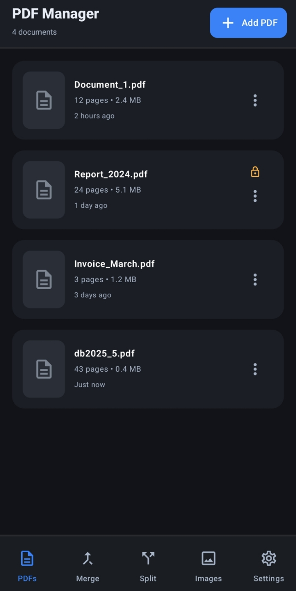
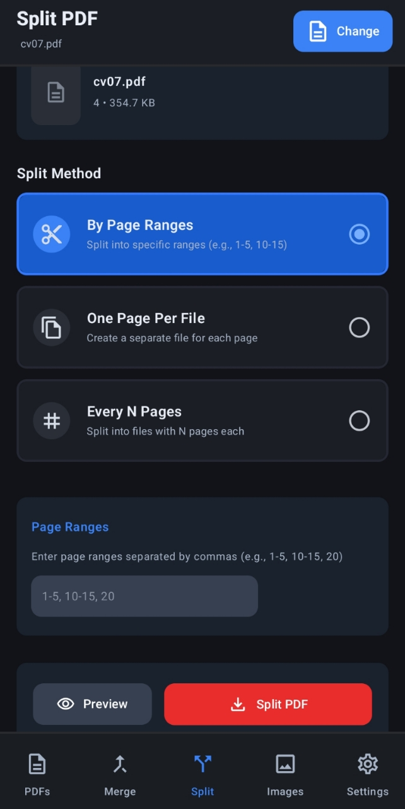
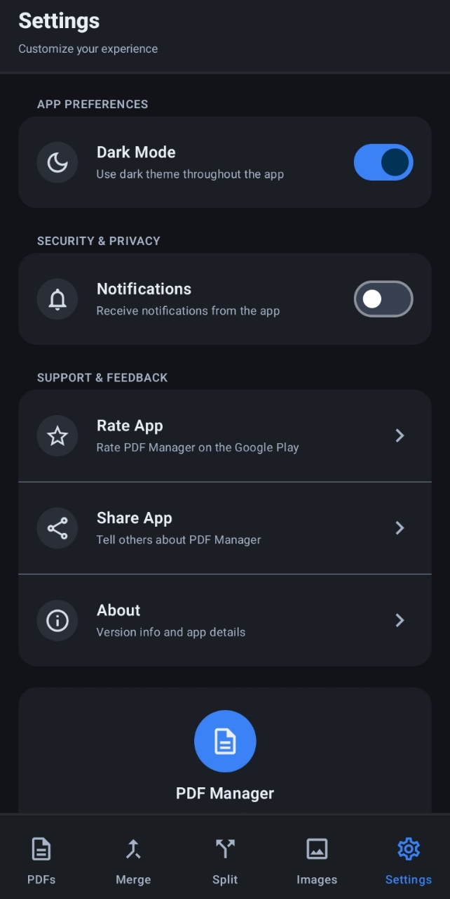
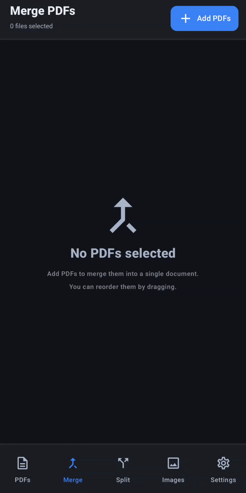
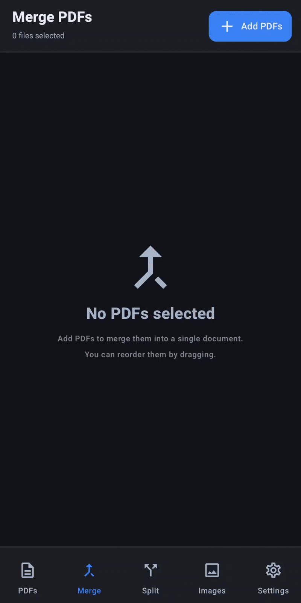

# PDF Manager - Android

The application works completely offline. The user opens a PDF through the system file dialog, sees page previews, sets the desired operation, and saves the result.

## Planned features:

- display of page previews, multiple selection, moving, deleting, rotating;
- merging multiple PDFs into one with visible page order;
- splitting a PDF: by ranges, one page per file, or every N pages;
- "pages per sheet": 2/4/6/9 pages per sheet, margins, orientation, fill order, live preview;
- PDF size reduction by lowering image quality/resolution with estimated final size;
- metadata editing (title, author, keywords, subject);
- password management: set a password when saving or remove it after entering the correct one;
- "from images → PDF": select photos, set order and orientation, preview, and save.

## Tech Stack
- Android Studio
- Kotlin
- Jetpack Compose (UI)
- PDFBox-Android (PDF manipulation)
- Storage Access Framework (SAF for file access)
- System page rendering for previews

## Website
https://pdfmanager.dev

---

## Screenshots
   

---

## Demo
   

---

## Status

This app is under active development. The demo and screenshots are illustrative and do not represent the final product. Features, UI, and performance will continue to evolve, and changes may occur between previews.
Detailed code comments and inline documentation will be added in later iterations of the project.
