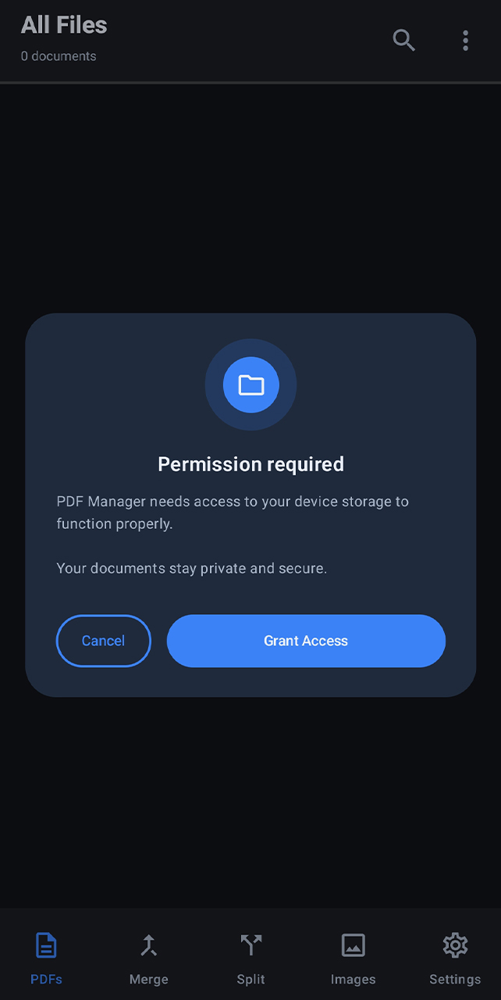
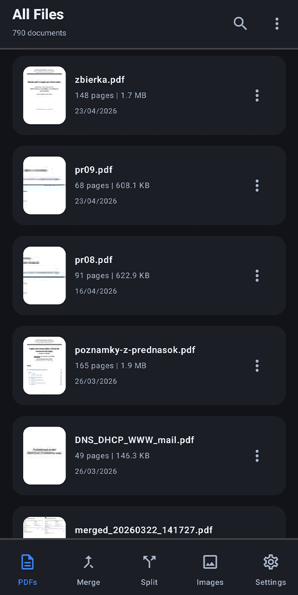
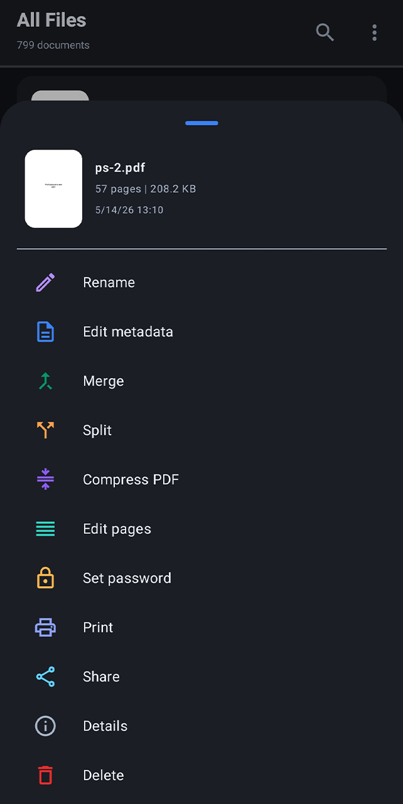
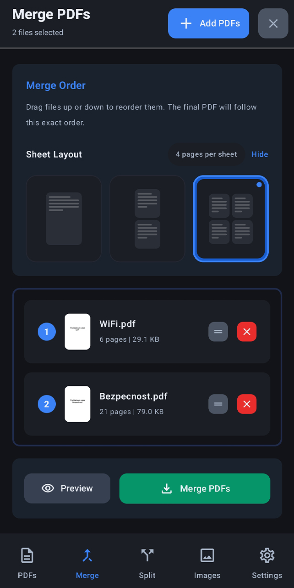
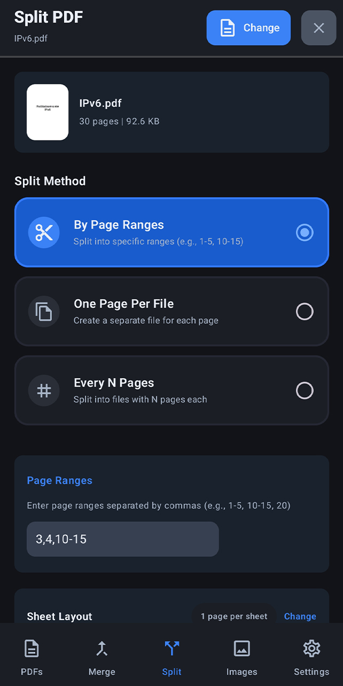
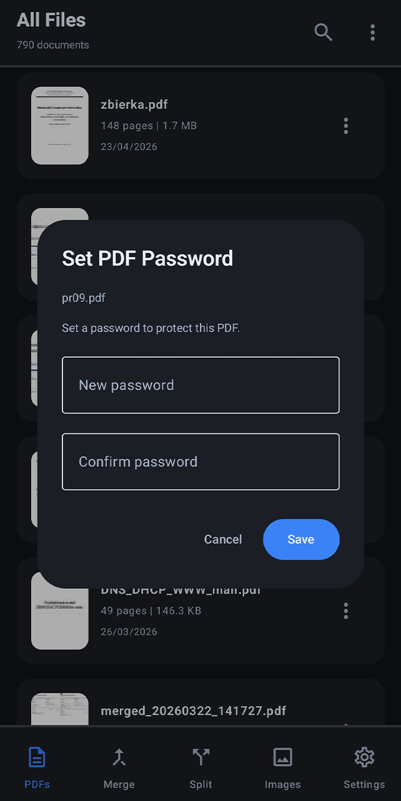
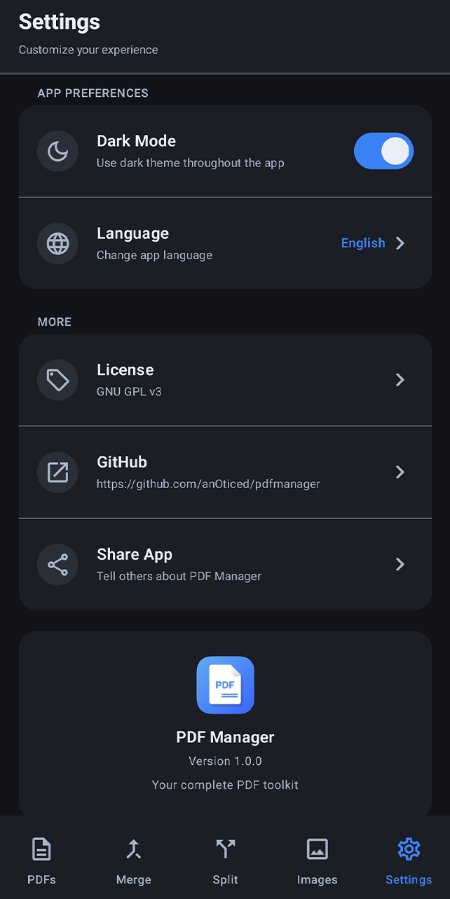
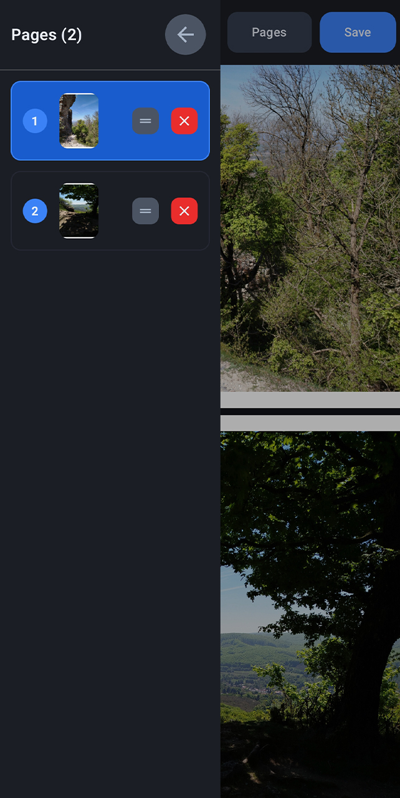
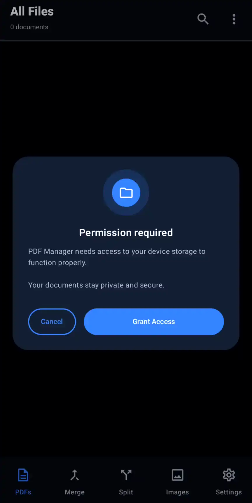

# PDF Manager for Android

**PDF Manager** is an offline Android application designed to provide a simple and convenient way to work with PDF documents on a mobile device. All files are processed locally without requiring an account, internet connection, or uploads to external services. Changes and generated results can be reviewed through a live preview before saving.

## Features

- PDF file management with thumbnails, search, sorting, selection, and file actions
- Preview with page navigation, zoom, and text search
- Merging and splitting documents
- Converting images to PDF
- Compression with three quality presets
- Visual page reordering and deletion with live preview
- Metadata and password management
- Sharing, printing, and opening documents from other applications
- Interface localization in 8 languages

## Requirements

- Android 12 or newer
- Storage access for displaying files available on the device
- Camera permission only when taking a photo

## Tech Stack

- Android Studio
- Kotlin
- Jetpack Compose and Material 3
- AndroidX ViewModel and Navigation Compose
- Storage Access Framework, MediaStore, and FileProvider
- [PDFBox-Android](https://github.com/TomRoush/PdfBox-Android)
- [AndroidX PDF Viewer](https://developer.android.com/jetpack/androidx/releases/pdf)
- [Reorderable](https://github.com/Calvin-LL/Reorderable) for drag-and-drop ordering

## Website
https://pdfmanager.dev

---

## Screenshots
   
  
  

---

## Demo
   
  
  
  

---

## Documentation

- [Project overview](docs/01_Project_Overview.md)
- [Architecture](docs/02_Architecture.md)
- [Kotlin concepts used](docs/03_Kotlin_Concepts_Used.md)
- [Android and Jetpack Compose basics](docs/04_Android_and_Compose_Basics.md)
- [Code tour](docs/05_Code_Tour.md)

## License

GNU GPL v3. See [LICENSE](LICENSE).
